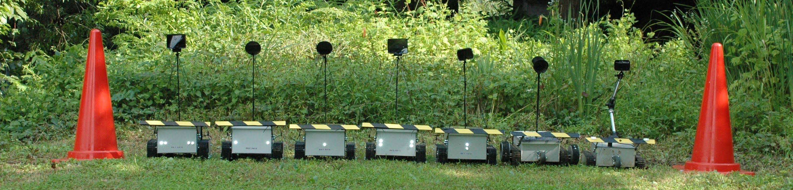

# Roktrack Pylon-Guided Robotic Mower
<div>
  
</div>

Open source robotic mower using image recognition technology. No GPS. No boundary wire.

- Just place the pylon and flip the switch.
- Solar charging and AC charging.
- As a surveillance camera that can detect person and animals while charging.

## Demo
### Single Operation
<div>
  
</div>

### Parallel Operation
<div>
  
</div>

# Requirement
* Raspberry Pi 3A+ or Raspberry Pi 4B
* libv4l-dev
* libssl-dev

# Installation
```bash
sudo apt install -y libv4l-dev libssl-dev
curl --proto '=https' --tlsv1.2 -sSf https://raw.githubusercontent.com/ysuito/roktrack/master/installation.sh | sh
```

# Usage
Surround the area to be mowed with pylons (traffic cones), place Roktrack and execute the following command.
```bash
cd roktrack
sudo ./roktrack
```

# License
The source code is licensed GPL v3.0. The files under the assets and hardware directories are licensed CC BY-NC-SA 4.0,see LICENSE.

## Links
### English
- [hackaday.io](https://hackaday.io/project/190977-roktrack-pylon-guided-mower)
### Japanese
- [Roktrack1 protopedia](https://protopedia.net/prototype/3357)
- [Roktrack2 protopedia](https://protopedia.net/prototype/3788)

