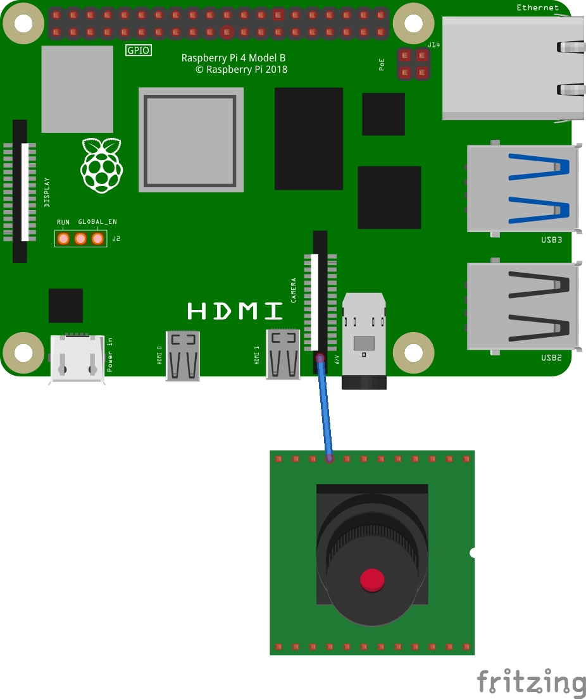
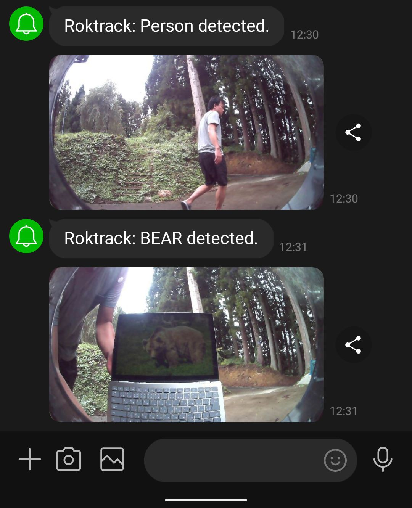
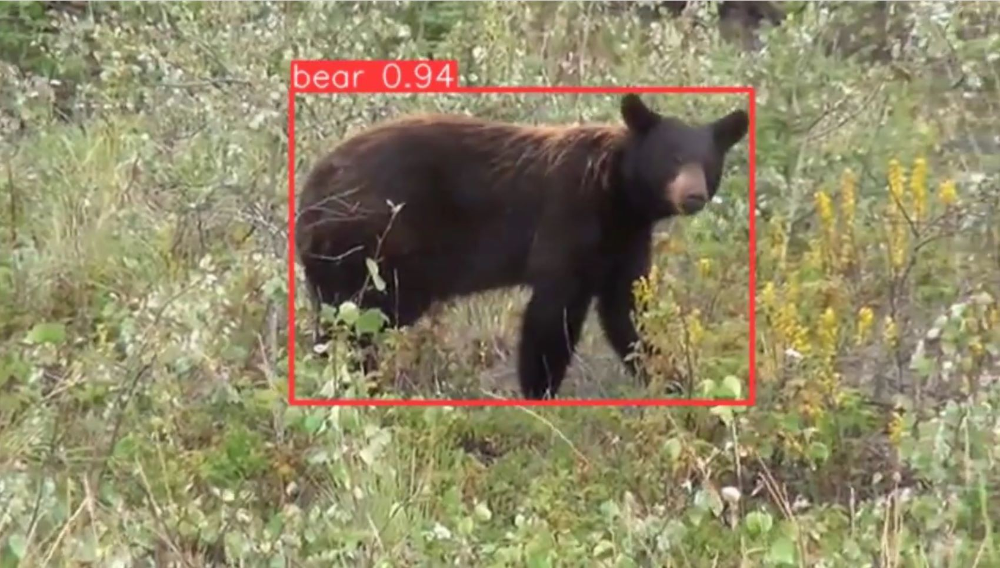
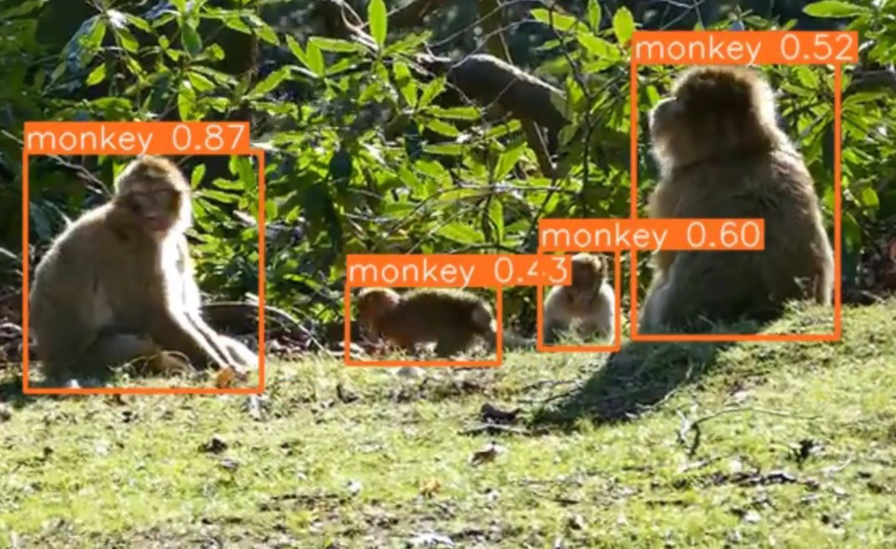

# As a simple surveillance camera
Roktrack can also be used as a surveillance camera to monitor and notify people and animals detection. All you need is a Raspberry Pi and a camera.

# Setup
- Connect the camera to the Raspberry Pi using CIS or USB.
- Install Roktrack as described in the [README](../README.md).
- To generate the default config, run `sudo ./roktrack` and stop it with `Ctrl + C`.
- Modify the relevant part of `/data/roktrack/config.toml` as follows.

```toml:/data/roktrack/config.toml
[drive]
  mode = 'monitor_animal' # Or 'monitor_person'
[notification]
  line_notify_token = 'YOUR-LINE-NOTIFY-TOKEN'
```

<div>
  
</div>

# Demo
<div>
  
</div>

## Bear
<div>
  
</div>

## Monkey
<div>
  
</div>


# Classes
## Person Monitoring Mode
- Person

## Animal Monitoring Modes
- bear
- deer
- monkey
- boar
- badger
- cat
- civet
- dog
- fox
- hare
- mice
- racoon
- squirrel